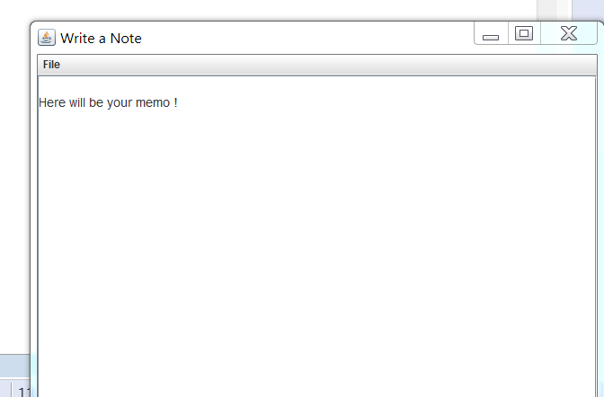

# sticky-note
simple Java-based todo memo, synchronized with www.protectedtext.com.

Build
-------------------
run build.cmd

Install
-------------------
copy target\sticky-notes-0.0.1-SNAPSHOT-jar-with-dependencies.jar to somewhere.  
Place config.json alongside with the jar with your credentials for www.protectedtext.com:

{"pass":"YourPass","site":"/yourSite"}

Do not put http://www.protectedtext.com in "site" param.

Run
-------------------
To run execute run.cmd

To open popup window presl Alt-Shift-1.  
Every time it is opened text is updated from site, when it get closed, new text is pushed to site.

To hide window press Esc.

There is also an icon in System Tray.

Develop
-------------------
Any ideas and contributions are welcome.

BUGS
-------------------
a lot.